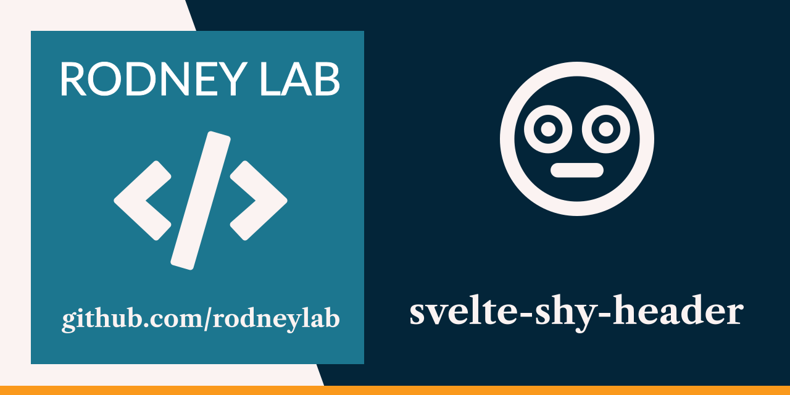

<p align="center">
  <a aria-label="Open Rodney Lab site" href="https://rodneylab.com" rel="nofollow noopener noreferrer">
    
  </a>
</p>
<h1 align="center">
  Svelte Shy Header
</h1>

# svelte-shy-header

[](https://stackblitz.com/github/rodneylab/svelte-shy-header)

SvelteKit demo code for implementing a shy, peekaboo page header which reappears when the user scrolls up. Code accompanies the <a aria-label="Open Rodney Lab blog post on tracking page views in Svelte Kit" href="https://rodneylab.com/svelte-shy-header/">article on Svelte shy header implementation</a>. If you have any questions, please drop a comment at the bottom of that page. As mentioned in the article, this code is based on a <a href="https://codepen.io/jaffathecake/pen/OJvbpRZ">Jake Archibald CodePen</a>.

## Building and previewing the site

If you're seeing this, you've probably already done this step. Congrats!

```bash
git clone https://github.com/rodneylab/svelte-shy-header.git
cd svelte-shy-header
pnpm install # or npm install
pnpm dev
```

## Building

```bash
pnpm run build
```

> You can preview the built app with `pnpm preview`, regardless of whether you installed an adapter. This should _not_ be used to serve your app in production.

Feel free to jump into the [Rodney Lab matrix chat room](https://matrix.to/#/%23rodney:matrix.org).
